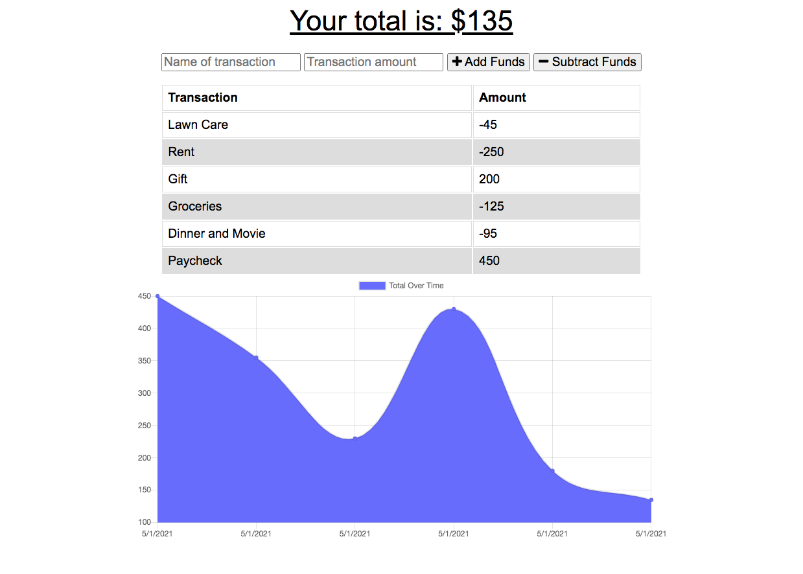

# Budget Tracker

## **Table of Contents**
========================
* [Description](#description)
* [Installation](#installation)
* [Contributors](#contributors)
* [Testing](#Testing)
* [Contact](#questions)

========================

### **Repository Name**  
budget-tracker

### **Description**  
A simple app to help users keep track of their budgets. This app is mobile friendly and useful because of its offline capability. Users can add or remove funds with the app and the app will update when it finds a data connection/internet.

### **Installation**  
N/A

### **Usage**  

https://budget-tracker-45.herokuapp.com/

### **Contributors**  
alehr45

### **Testing**  
#### Test this app by using chrome dev tools. 
#### In the Network tab, find the dropdown menu and choose connection to Offline. 
#### Next attempt to make a transaction. 
#### If you then use the dropdown menu to go back online you will see that the transaction has been added and a message has appeeared to confirm.

========================

### Questions?
##### GitHub: www.github.com/alehr45  

========================
